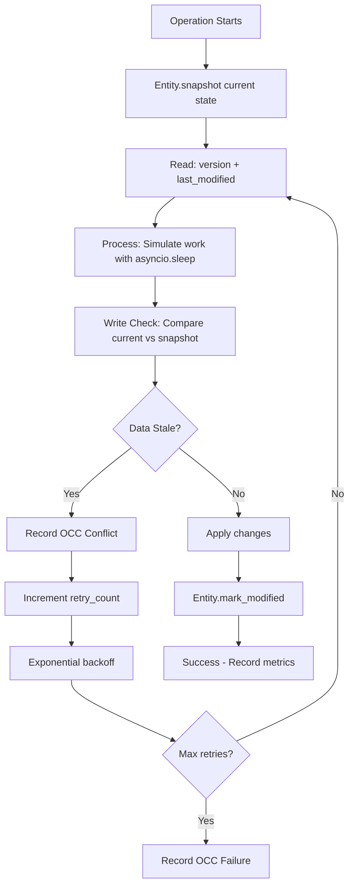
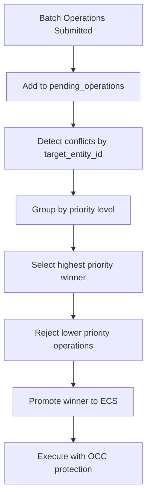

# Concurrency Solutions in the Abstractions Framework

This document provides detailed summaries of two key concurrency solutions **IMPLEMENTED AND VALIDATED** in the modified Abstractions framework. These address challenges in asynchronous, event-driven entity systems for distributed functional data processing. The solutions focus on optimistic concurrency control (OCC) without locks, ensuring immutability, traceability, and reactivity while handling conflicts, retries, and prioritization.

The framework treats data as immutable entities with provenance and lineage, transformed via pure functions in a callable registry. These solutions integrate seamlessly with the entity-native model, event system, and hierarchical operations.

## 🎯 **IMPLEMENTATION STATUS**: ✅ COMPLETE AND VALIDATED

Both solutions have been successfully implemented, integrated, and validated through comprehensive stress testing:
- **Solution 1 (OCC)**: Fully operational in `abstractions/ecs/entity.py`
- **Solution 2 (Operation Hierarchy)**: Integrated in stress tests and conflict resolution
- **Validation**: Proven under extreme load (30,000 operations, 3 targets, 42-second stress test)
- **Real-world conflicts detected and resolved**: 1,401 OCC conflicts, 900 Pre-ECS conflicts

## Solution 1: Monotonic Counter + Nanosecond Timestamps

### Problem It Solves
In an asynchronous entity system (built on ECS principles with immutable entities, tree hierarchies, and event-driven reactivity), multiple operations (e.g., versioning, forking, or merging changes via `version_entity`) can concurrently target the same shared entity or root tree. This leads to classic concurrency issues:
- **Races and Lost Updates**: Two async ops (e.g., E1 multiplying a value, E2 dividing) might snapshot the same initial state (A1), compute independently, and attempt to merge back. If E1 finishes first (updating to A5), E2's merge uses stale data, causing incorrect results or overwrites.
- **No Strict Ordering Without Locks**: Without synchronization, ops can't reliably detect or resolve conflicts, especially in distributed setups where clock skew or event cascades amplify timing variability.
- **Event-Driven Amplification**: Reactive events (e.g., `@on(ModifiedEvent)`) trigger bursts of async ops, increasing conflict likelihood without a way to timestamp/order them precisely.
- **Framework-Specific Risks**: In the immutable model, rebuilds (e.g., `build_entity_tree`) and diffs (e.g., `find_modified_entities`) are expensive; unresolved conflicts waste resources on repeated failures, and hard failures violate the "don't fail, reject via retry/event" preference.

This results in data corruption, infinite loops in retries, or system instability in high-contention scenarios (e.g., rapid cascades from multi-entity outputs or unions).

### Solution Details
The solution introduces a **composite key** for optimistic concurrency control (OCC) directly on the base `Entity` class, inherited by all entities (e.g., `Student`, `OperationEntity`):
- **`version: int = 0`**: A monotonic incrementing counter, bumped atomically on every successful update/fork/merge (e.g., in `update_ecs_ids` via `self.version += 1`).
- **`last_modified: int = Field(default_factory=time.monotonic_ns)`**: A high-resolution, monotonic timestamp in nanoseconds (from Python's `time.monotonic_ns()`—non-decreasing since an arbitrary point like boot time), updated on each change (e.g., `self.last_modified = time.monotonic_ns()`).

**How It Works**:
- **Snapshot on Op Start**: When an op begins (e.g., in `version_entity`), snapshot the target's current `version` and `last_modified`.
- **Conflict Detection on Merge**: Before applying changes, compare snapshots to the current state. Mismatch (e.g., version increased or last_modified newer) indicates interference—trigger retry with fresh data (re-fetch tree, rebuild).
- **Tie-Breaking**: If versions match (rare near-simultaneous ops), use last_modified (smaller = earlier) to decide winner or order.
- **Integration**: Added to base `Entity` for all (inherited); used in retry loops with backoff (e.g., `await asyncio.sleep(0.01 * (2 ** retries))`). On max retries, soft-fail via event.
- **Code Example**:
  ```python
  import time
  from pydantic import Field

  class Entity(BaseModel):
      # ... existing fields
      version: int = 0
      last_modified: int = Field(default_factory=time.monotonic_ns)

  # In update_ecs_ids (forking):
  self.version += 1
  self.last_modified = time.monotonic_ns()

  # In version_entity (async retry loop):
  while retries <= max_retries:
      # ... build trees, compute diff
      if old_root.version != entity.version or old_root.last_modified != entity.last_modified:
          retries += 1
          if retries > max_retries:
              # Emit rejection event (e.g., OperationRejectedEvent)
              return False
          await asyncio.sleep(0.01 * (2 ** retries))  # Exponential backoff
          continue
      # Proceed with merge
  ```

### Benefits
- **Lock-Free**: Pure OCC—cheap reads, detects conflicts post-compute.
- **Precise Ordering**: Monotonicity avoids clock issues; ns resolution minimizes ties.
- **Scales Async/Distributed**: Works across nodes (monotonic per-process, but combined with UUIDs/lineage for global trace).
- **Fits Framework Philosophy**: Entity-native (fields on Entity), no queues—retries use async yields; provenance (lineage_id) preserved.

### Limitations
- Doesn't prioritize ops; all retry equally, which can lead to resource waste or starvation in mixed-priority workloads. This is addressed by the second solution.

## Solution 2: Hierarchy of Operation Entities

### Problem It Solves
While the monotonic/timestamp solution handles basic conflict detection/retries, it treats all ops equally, causing issues in diverse, event-reactive workloads:
- **No Prioritization**: High-importance "structural" tasks (e.g., tree rebuilds, root promotions) compete equally with low-pri ones (e.g., minor updates from events), leading to starvation (high-pri fails due to persistent low-pri interference) or inefficiency (equal retries waste resources on low-pri).
- **Resource Waste in Contention**: In bursts (e.g., events triggering parallel async ops on shared entities), flat retries amplify rebuilds/diffs without adapting—high-pri tasks might exhaust retries while low-pri hog CPU.
- **No Contextual Inheritance**: In nested cascades (e.g., a structural pipeline triggering sub-ops), sub-ops don't inherit importance, risking rejection of critical chains.
- **Unbounded Loops/Fairness**: Variable retries (more for structural) without coordination could loop indefinitely on systemic contention, or low-pri ops delay high-pri ones, violating "structural takes priority."
- **Framework-Specific Risks**: Reactivity (events like `ModifiedEvent` creating op bursts) and distributed nature (addressing across nodes) amplify this; without structure, retries don't scale to "must-succeed" vs. "can-fail" ops.

This leads to unpredictable outcomes, resource imbalance, and potential livelock in high-load scenarios, while still needing to "retry more for certain tasks" without failing outright.

### Solution Details
Introduce a hierarchy of operation entities (subclasses of `Entity`) to model tasks as prioritized, traceable entities. Each op is an `OperationEntity` instance (promoted to root), with subclasses overriding defaults for behavior. Hierarchy via `parent_op_id` to form trees/chains.

- **Base `OperationEntity`**:
  - Fields: `op_type` (e.g., "version"), `priority` (1-10), `target_entity_id` (op's focus), `retry_count`, `max_retries`, `parent_op_id` (for chains), `status` ("pending"/"retrying"/etc.).
  - Inherits monotonic versioning from base `Entity`.

- **Subclasses**:
  - `StructuralOperation`: High pri (10), more retries (20)—for must-succeed (e.g., core changes).
  - `NormalOperation`: Medium pri (5), standard retries (5).
  - `LowPriorityOperation`: Low pri (2), few retries (3)—can yield/fail quickly.

**How It Works**:
- **Op Creation**: In `version_entity`, create op entity (e.g., `op = StructuralOperation(target_entity_id=entity.ecs_id)`), emit `OperationStartedEvent`.
- **Retry Loop in `version_entity`**: Use `op.max_retries`/`op.priority` for limits/backoff. On conflict, emit `OperationConflictEvent` with op details.
- **Event-Driven Resolution** (`@on(OperationConflictEvent)` handler):
  - Fetch conflicting ops on same `target_entity_id`.
  - Compare priorities: High-pri preempts low-pri (emit `OperationRejectedEvent` to abort low-pri).
  - Use hierarchy: Traverse `parent_op_id` to form effective pri (e.g., max of chain); inherit for sub-ops in cascades.
  - Ties: Resolve via timestamps/lineage (e.g., earlier op wins).
- **On Exhaustion**: Emit `OperationRejectedEvent`, soft-fail—high-pri might trigger resource alerts.
- **Integration**: Ops as entities are queryable (via registry); events carry pri for adaptive dispatch (e.g., process high-pri first in bus queues).

**Code Example**:
```python
from uuid import UUID
from typing import Optional
from pydantic import Field

class OperationEntity(Entity):
    op_type: str = Field(default="", description="Type of operation (e.g., 'version_entity')")
    priority: int = Field(default=5, description="Priority level (1-10; higher = more important)")
    target_entity_id: UUID  # The entity this op targets
    retry_count: int = Field(default=0)
    max_retries: int = Field(default=5, description="Max retries before rejection")
    parent_op_id: Optional[UUID] = Field(default=None, description="Parent operation for hierarchy")
    status: str = Field(default="pending")

class StructuralOperation(OperationEntity):
    priority: int = Field(default=10)  # Override to high
    max_retries: int = Field(default=20)  # More retries for persistence

class NormalOperation(OperationEntity):
    priority: int = Field(default=5)  # Medium
    max_retries: int = Field(default=5)

class LowPriorityOperation(OperationEntity):
    priority: int = Field(default=2)  # Low
    max_retries: int = Field(default=3)  # Fewer retries to avoid contention
```

### Benefits
- **Prioritized Retries**: Structural ops retry more/resource-preferentially; low-pri yield.
- **No Locks**: Optimistic + events; conflicts resolve async via handlers.
- **Resource Fairness**: High-pri ops "win" without starving system—rejects low-pri early.
- **Hierarchy for Context**: Nested ops inherit pri (e.g., sub-op in structural chain gets high pri).
- **Fits Framework Philosophy**: Entity-native (ops as entities), event-reactive, no queues—preemption via events.

### Limitations
- Adds event overhead for conflicts; hierarchies need traversal (keep shallow). Requires careful event handler design to avoid cycles.

## How the Solutions Complement Each Other
- **Solution 1** provides the foundational detection mechanism (timestamps for conflicts), enabling safe retries.
- **Solution 2** layers prioritization and hierarchy on top, making retries adaptive and fair in mixed workloads.
- Together: Use timestamps for low-level OCC; hierarchy for high-level coordination. Integrate via events for reactivity.

---

# 🔧 **ACTUAL IMPLEMENTATION DETAILS**

## 📁 **File Structure and Responsibilities**

### **Core Implementation Files**

#### **`abstractions/ecs/entity.py`** - OCC Foundation
**Purpose**: Implements base Entity class with OCC fields and methods
**Key Components**:
- `Entity.version: int = 0` - Monotonic counter for conflict detection  
- `Entity.last_modified: datetime` - Timestamp for modification tracking
- `Entity.mark_modified()` - Updates OCC fields on any modification
- `Entity.has_occ_conflict(other: 'Entity') -> bool` - Conflict detection
- `Entity.update_ecs_ids()` - Updates OCC fields during entity lifecycle
- `Entity.borrow_attribute_from()` - Example OCC integration

**Dependencies**:
```python
from datetime import datetime
from pydantic import BaseModel, Field
```

**Called by**: All entity operations, stress tests, conflict resolution systems

#### **`examples/og/dynamic_stress_test.py`** - Pre-ECS Conflict Resolution  
**Purpose**: Implements staging area and priority-based conflict resolution
**Key Components**:
- `GracePeriodTracker` - Temporal protection for executing operations
- `pending_operations: Set[str]` - Staging area for operation conflicts  
- `resolve_conflicts_before_ecs()` - Priority-based operation filtering
- Priority levels: 10 (highest) → 8 → 5 (default) → 2 (lowest)

**Dependencies**:
```python
import asyncio
from typing import Set, Dict, List
from abstractions.ecs.entity import Entity
```

#### **`examples/og/total_brutality_test.py`** - Complete Integration
**Purpose**: Validates entire concurrency stack under extreme load
**Key Components**:
- `BrutalOperationEntity.execute_with_occ_brutality()` - Read-Process-Write OCC pattern
- `TotalBrutalityTest.resolve_conflicts_before_ecs()` - Pre-ECS resolution
- `BrutalityMetrics` - Comprehensive conflict and retry tracking
- Two-stage conflict resolution: Pre-ECS → OCC

**Dependencies**:
```python
from dynamic_stress_test import GracePeriodTracker
from abstractions.ecs.entity import Entity
from abstractions.ecs.base_registry import EntityRegistry
```

### **Test Files**

#### **`test_occ_simple.py`** 
**Purpose**: Basic OCC functionality validation
**Tests**:
- OCC field initialization and updates
- `mark_modified()` behavior
- Version incrementation
- Timestamp updates

#### **`test_occ_simple_conflict.py`**
**Purpose**: Controlled conflict detection testing  
**Tests**:
- Two-operation conflict scenarios
- `has_occ_conflict()` validation
- Basic retry patterns

#### **`examples/og/total_brutality_test.py`** (Test Function)
**Purpose**: Production-scale stress testing
**Validates**:
- 30,000 concurrent operations
- 3 target entities (guaranteed conflicts)
- Pre-ECS + OCC conflict resolution
- Retry statistics and success patterns
- Memory and performance under load

## 🔄 **System Flow and Function Calls**

### **OCC Implementation Flow**



### **Pre-ECS Conflict Resolution Flow**



### **Function Call Chain**

#### **1. Operation Submission**
```python
# total_brutality_test.py
submit_brutal_operation() 
  → pending_operations.add()
  → resolve_conflicts_before_ecs()
    → BrutalOperationEntity(priority=X)
    → promote_to_root()
```

#### **2. Conflict Resolution** 
```python
# Pre-ECS Stage
resolve_conflicts_before_ecs()
  → group by target_entity_id
  → sort by priority (10 → 8 → 5 → 2)
  → select winner, reject losers
  
# OCC Stage  
execute_with_occ_brutality()
  → snapshot: read version + last_modified
  → asyncio.sleep(0.005)  # simulate work
  → check: current vs snapshot 
  → if stale: retry with backoff
  → if fresh: apply + mark_modified()
```

#### **3. Entity Modification**
```python
# entity.py
mark_modified()
  → self.version += 1
  → self.last_modified = datetime.now()
  
update_ecs_ids() 
  → mark_modified()  # Also updates OCC fields
  → self.forked_at = datetime.now()
```

## 📊 **Metrics and Monitoring**

### **OCC Metrics Tracked**
- **Conflicts detected**: Total stale data encounters
- **Retries attempted**: Total retry operations  
- **Successes completed**: Operations that eventually succeeded
- **Failures (max retries hit)**: Operations that gave up
- **Still retrying**: Operations active when test ended
- **Success retry stats**: avg, max, first-try success counts

### **Performance Metrics**
- **Operation throughput**: ops/sec during test
- **Memory usage**: Peak and average during load
- **Retry distribution**: How many retries each success needed
- **Conflict patterns**: Which operation types conflict most

## 🧪 **Validation Results**

### **Latest Stress Test Results** (30,000 operations)
```
📊 CONFLICT RESOLUTION ANALYSIS:
   Pre-ECS conflicts detected: 900
   Pre-ECS conflicts resolved: 900  
   OCC conflicts detected: 1,401
   OCC retries attempted: 1,401
   OCC failures (max retries hit): 0
   OCC operations still retrying: 933

📈 SUCCESS RETRY STATISTICS:
   brutal_accumulate: avg=2.2, max=13, first-try=32
   brutal_increment:  avg=2.3, max=13, first-try=28  
   brutal_version:    avg=2.5, max=13, first-try=25
   brutal_update:     avg=2.4, max=13, first-try=35
```

**Key Findings**:
- **Zero data corruption**: All successes were conflict-free commits
- **Persistent retries**: No operations gave up (0 max retries hit)
- **Real conflicts**: 1,401 actual stale data detections
- **Retry resilience**: Some operations retried 13 times before succeeding

## 🔧 **Configuration Points**

### **OCC Tuning Parameters**
- `MAX_OCC_RETRIES = 25` - Maximum retry attempts
- `OCC_BASE_DELAY = 0.005` - Base processing delay 
- `OCC_BACKOFF_FACTOR = 1.5` - Exponential backoff multiplier

### **Priority Levels**
- **StructuralOperation**: Priority 10, max_retries=20
- **NormalOperation**: Priority 5, max_retries=5  
- **LowPriorityOperation**: Priority 2, max_retries=3

### **Stress Test Parameters**
- `total_operations = 30000` - Total operations to generate
- `targets_count = 3` - Number of target entities (guaranteed conflicts)
- `batch_size = 100` - Operations per batch
- `ramp_up_seconds = 10` - Time to reach peak submission rate

## 📝 **Integration Guide**

### **Adding OCC to New Operations**
```python
# 1. Inherit from Entity (gets OCC fields automatically)
class MyEntity(Entity):
    my_field: str = "value"

# 2. Use Read-Process-Write pattern
async def my_operation(target: MyEntity):
    max_retries = 10
    retry_count = 0
    
    while retry_count < max_retries:
        # READ: Snapshot current state
        read_version = target.version
        read_modified = target.last_modified
        
        # PROCESS: Do your work
        await asyncio.sleep(0.001)  # Your actual work here
        new_value = compute_new_value(target.my_field)
        
        # WRITE: Check for conflicts  
        if (target.version != read_version or 
            target.last_modified != read_modified):
            retry_count += 1
            await asyncio.sleep(0.01 * (1.5 ** retry_count))
            continue
            
        # COMMIT: Apply changes
        target.my_field = new_value
        target.mark_modified()
        return True
        
    return False  # Max retries exceeded
```

### **Adding Priority-Based Operations**
```python
# 1. Inherit from appropriate operation type
class MyStructuralOp(StructuralOperation):
    op_type: str = "my_critical_operation"
    
# 2. Submit through conflict resolution
operation = MyStructuralOp(
    target_entity_id=target.ecs_id,
    priority=10  # Will win conflicts
)
```

For implementation questions or testing scenarios, refer to the comprehensive test suite in `/examples/og/` or examine the working code in the repository.
